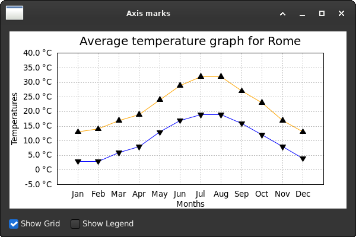

# wx-temperature-plot

A small wxPython application that plots monthly temperature climatology
(minimum and maximum averages, with optional 1-sigma error bars) for any
city, fetched from the Open-Meteo historical weather archive.

The project is a working refactor of `sample_two.py` from the wxPython
wiki page
[How to use Plot - Part 2 (Phoenix)](https://wiki.wxpython.org/How%20to%20use%20Plot%20-%20Part%202%20%28Phoenix%29),
extended with a separate fetch script that downloads real climate data from
[Open-Meteo](https://open-meteo.com).

## Requirements

- Linux with GTK3 (tested on Debian 12)
- Python 3.x
- wxPython 4.x

On Debian / Ubuntu:

    sudo apt install python3-wxgtk4.0

No `pip` dependencies. `urllib`, `json`, `datetime` are all in the
standard library.

## Usage

Two scripts, separation of concerns. `fetch_temperatures.py` downloads
and aggregates raw daily data into `temperatures.json`. `sample_two.py`
reads the JSON and plots it.

    # Show the bundled Rome sample.
    python3 plot_temperatures.py

    # Fetch fresh climatology for the default city (Rome, last 10 years).
    python3 fetch_temperatures.py

    # Or specify a city and time window.
    python3 fetch_temperatures.py Reykjavik 5
    python3 fetch_temperatures.py "Buenos Aires" 15

    # Re-launch the GUI to view the new data.
    python3 plot_temperatures.py

The GUI works offline once `temperatures.json` exists. Re-run the fetch
whenever you want fresh data or a different location.

## Files

    fetch_temperatures.py    Network fetch and monthly aggregation.
    plot_temperatures.py                 wxPython GUI that plots the JSON file.
    temperatures.json        Plot data (Rome sample bundled).
    icons/wxwin.ico          Optional window icon (silently skipped if absent).

## Data source

Historical weather data from the
[Open-Meteo Historical Weather API](https://open-meteo.com/en/docs/historical-weather-api),
geocoding from the Open-Meteo geocoding endpoint, both licensed
CC BY 4.0 and free for non-commercial use up to 10,000 daily calls.
No API key required.

## How standard deviation is computed

When `fetch_temperatures.py` produces the JSON, each monthly value is
the arithmetic mean of all daily minima / maxima across the requested
year range (about 300 daily observations per month for 10 years). The
accompanying `stddev` is the sample standard deviation with Bessel's
correction (`n - 1` divisor), representing inter-annual variability of
the typical day in that month. The plot draws each `stddev` as a
vertical 1-sigma error bar.

## History and credits

| Date       | Author     | Change |
|------------|------------|--------|
| 2010-09-22 | Giuseppe Costanzi | Original `sample_two.py` based on Mike Driscoll's wxPython pyplot tutorial. Posted on the `wxpython-users` Google group. |
| 2020-10-21 | Ecco       | Ported to wxPython Phoenix (wx 4.x), incorporated into the official wxPython wiki. |
| 2026-05    | Refactor   | snake_case, externalised data, Open-Meteo integration, automatic axis bounds, 1-sigma error bars. |

## License

MIT. See `LICENSE`. Original 2010 attribution is preserved in the script
headers and in the credits above.
